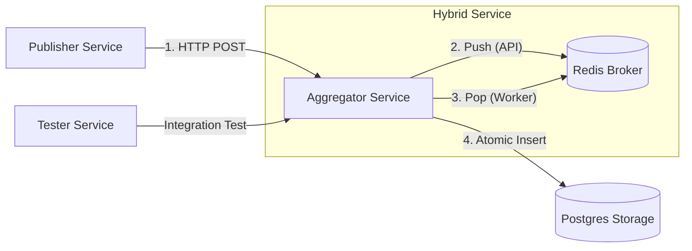

**UAS Sistem Terdistribusi**

# Pub-Sub Log Aggregator Terdistribusi (Async Architecture)

Sistem ini adalah implementasi **Distributed Log Aggregator** yang dirancang untuk menangani ribuan event dengan jaminan **Idempotency** (anti-duplikasi), **Data Persistence**, dan **Concurrency Control**. Dibangun menggunakan Python (FastAPI), Docker Compose, PostgreSQL (AsyncPG), dan Redis. Sistem ini menggunakan arsitektur **Hybrid Asynchronous**: API menerima request dan memasukkannya ke antrian Redis, sementara *Background Worker* memproses penyimpanan ke database.

## 📋 Fitur Utama
1.  **Idempotent Consumer:** Menggunakan database constraints (`UNIQUE(topic, event_id)`) untuk menjamin event yang sama persis tidak diproses dua kali.
2.  **Asynchronous Processing:** Menggunakan Redis sebagai buffer antrian untuk menampung lonjakan traffic tanpa membebani database secara langsung.
3.  **Concurrency Control:** Menangani race condition menggunakan transaksi atomik database (`INSERT ... ON CONFLICT DO NOTHING`).
4.  **Data Persistence:** Data tersimpan aman di PostgreSQL menggunakan Docker Named Volumes, tahan terhadap restart container.
5.  **High Performance:** Mampu memproses 20.000+ event dengan throughput tinggi menggunakan `asyncio` dan `asyncpg`.
6.  **Observability:** Endpoint `/stats` memantau metrik real-time: *throughput* (EPS), *latency*, *duplicate rate*, dan *queue depth*.

---

## 🏗️ Arsitektur Sistem

Sistem terdiri dari 4 layanan yang diorkestrasi oleh Docker Compose:


```
|  Layanan   |              Teknologi               |                                    Fungsi                                  |
|------------|--------------------------------------|----------------------------------------------------------------------------|
| Aggregator | Python (FastAPI), Redis, AsyncPG     | Menerima API request (Producer) DAN memproses antrian background (Consumer)|
| Publisher  | Python (Requests)                    | Generator traffic. Mengirim 20.000 event dengan rasio duplikasi 30%.       |
| Storage    | PostgreSQL 16                        | Database utama. Menyimpan event unik secara persisten.                     |
| Broker     | Redis 7                              | Menampung event sementara sebelum diproses worker.                         |
| Tester     | Pytest, HTTPX                        | Layanan khusus untuk menjalankan Black-box Integration Testing.            |
```

---

## 🚀 Cara Menjalankan (Build & Run)

Prasyarat
- Docker & Docker Compose terinstall.

### 1. Menjalankan Sistem
Jalankan perintah berikut di terminal root proyek:
```
docker compose up --build -d
```
Setelah dijalankan:
- Aggregator akan menunggu database siap (retry logic aktif).
- Publisher akan otomatis mulai mengirim 20.000 event ke API.

### 2. Menghentikan Sistem
- Data di database tetap tersimpan di volume docker
```
docker compose down
```
- Menghapus data bersih (reset total)
```
docker compose down -v
```

---

## 🧪 Cara Melakukan Testing (Unit & Integration)
Proyek ini dilengkapi dengan container khusus (tester) untuk melakukan pengujian otomatis sesuai rubrik (17 Test Cases). Tes mencakup:
- Validasi Skema JSON (Negative Test).
- Verifikasi Deduplikasi (Idempotency Test).
- Konsistensi Statistik & Queue Depth (Logic Test).
- Health Check (Connectivity Test).

Untuk menjalankan unit test :
```
docker compose run --rm tester
``` 

---

## 📡 Dokumentasi API

Base URL: `http://localhost:8080` (Internal Docker Network: `http://aggregator:8080`)

### 1. Health Check
Mengecek status layanan.
- **Method:** `GET`
- **Path:** `/`
- **Response:** `{"status": "alive", "service": "aggregator"}`

### 2. Publish Event
Menerima event baru. Jika event ID dan Topic sudah ada, sistem akan merespons sukses tetapi tidak menyimpannya (Idempotent).

- **Method:** `POST`
- **Path:** `/publish`
- **Body Example:**
  ```json
  {
    "topic": "user.login",
    "event_id": "unique-uuid-12345",
    "timestamp": "2025-12-08T10:00:00Z",
    "source": "publisher-01",
    "payload": { "user_id": 1 }
  }
  ```

Response:
- 202 Accepted: Event berhasil masuk antrian (Queued).
  ```json
  { "status": "queued", "id": "unique-uuid-12345" }
  ```

### 3. Get Stats
Melihat statistik performa dan deduplikasi.
- **Method:** `GET`
- **Path:** `/stats`
- **Response Example:**
  ```json
  {
    "uptime_stats": {
        "received_api": 20000,
        "processed_worker": 14000,
        "dropped_worker": 6000
    },
    "performance_metrics": {
        "throughput_eps": 450.55,
        "avg_latency_ms": 12.45,
        "duplicate_rate_percent": 30.0,
        "uptime_seconds": 15.2
    },
    "system_state": {
        "database_rows": 14000,
        "queue_depth": 0
    }
  }
  ```

  ---

# 👤 Author
#### Wiranto (Wira)
#### 📍 Institut Teknologi Kalimantan
#### Youtube : youtube.com/watch?si=eCJECqlepAxaRVwd&v=0Vthak9lGCE&feature=youtu.be
#### 📧 github.com/Wiraproject