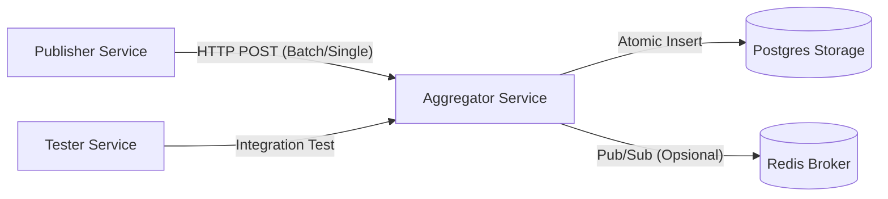

**UAS Sistem Terdistribusi**

Sistem ini adalah implementasi **Distributed Log Aggregator** yang dirancang untuk menangani ribuan event dengan jaminan **Idempotency** (anti-duplikasi), **Data Persistence**, dan **Concurrency Control**. Dibangun menggunakan Python (FastAPI), Docker Compose, PostgreSQL, dan Redis.

## 📋 Fitur Utama
1.  **Idempotent Consumer:** Menggunakan database constraints (`UNIQUE(topic, event_id)`) untuk menjamin event yang sama persis tidak diproses dua kali.
2.  **Concurrency Control:** Menangani race condition menggunakan transaksi atomik database (`INSERT ... ON CONFLICT DO NOTHING`).
3.  **Data Persistence:** Data tersimpan aman di PostgreSQL menggunakan Docker Named Volumes, tahan terhadap restart container.
4.  **High Performance:** Mampu memproses 20.000+ event dengan throughput tinggi menggunakan `asyncio` dan `asyncpg`.
5.  **Fault Tolerance:** Implementasi *Retry Logic* dengan *Backoff* saat koneksi database belum siap.
6.  **Observability:** Endpoint `/stats` untuk memantau metrik *received*, *processed*, dan *dropped*.

---

## 🏗️ Arsitektur Sistem

Sistem terdiri dari 4 layanan yang diorkestrasi oleh Docker Compose:



|    Layanan     |              Teknologi               |                                  Fungsi                              |
|--- ------------|--------------------------------------|----------------------------------------------------------------------|
| **Aggregator** | Python (FastAPI), SQLAlchemy (Async) | Core service. Menerima event, validasi, dan deduplikasi ke DB.       |
| **Publisher**  | Python (Requests)                    | Generator traffic. Mengirim 20.000 event dengan rasio duplikasi 30%. |
| **Storage**    | PostgreSQL 16                        | Database utama. Menyimpan event unik secara persisten.               |
| **Broker**     | Redis 7                              | Message broker untuk komunikasi internal (opsional/future use).      |
| **Tester**     | Pytest, HTTPX                        | Layanan khusus untuk menjalankan *Black-box Integration Testing*.    |

---

## 🚀 Cara Menjalankan (Build & Run)

Prasyarat
- Docker & Docker Compose terinstall.

1. Menjalankan Sistem
Jalankan perintah berikut di terminal root proyek:
```
docker compose up --build -d
```
Setelah dijalankan:
- Aggregator akan menunggu database siap (retry logic aktif).
- Publisher akan otomatis mulai mengirim 20.000 event (campuran data baru dan duplikat).

2. Menghentikan Sistem
- Data di database tetap tersimpan di volume docker
```
docker compose down
```
- Menghapus data bersih (reset total)
```
docker compose down -v
```

---

## 🧪 Cara Melakukan Testing (Unit & Integration)
Proyek ini dilengkapi dengan container khusus (tester) untuk melakukan pengujian otomatis sesuai rubrik (17 Test Cases). Tes mencakup:
- Validasi Skema JSON (Negative Test).
- Verifikasi Deduplikasi (Idempotency Test).
- Konsistensi Statistik (Logic Test).
- Health Check (Connectivity Test).

Untuk menjalankan unit test :
```
docker compose run --rm tester
``` 

---

## 📡 Dokumentasi API

Base URL: `http://localhost:8080` (Internal Docker Network: `http://aggregator:8080`)

### 1. Health Check
Mengecek status layanan.
- **Method:** `GET`
- **Path:** `/`
- **Response:** `{"status": "alive", ...}`

### 2. Publish Event
Menerima event baru. Jika event ID dan Topic sudah ada, sistem akan merespons sukses tetapi tidak menyimpannya (Idempotent).

- **Method:** `POST`
- **Path:** `/publish`
- **Body Example:**
  ```json
  {
    "topic": "user.login",
    "event_id": "unique-uuid-12345",
    "timestamp": "2025-12-08T10:00:00Z",
    "source": "publisher-01",
    "payload": { "user_id": 1 }
  }
  ```

Response:
- 201 Created: Event baru berhasil disimpan.
- 200 OK: Event duplikat (dropped/idempotent response).

### 3. Get Stats
Melihat statistik performa dan deduplikasi.
- **Method:** `GET`
- **Path:** `/stats`
- **Response Example:**
  ```json
  {
    "uptime_stats": {
        "received": 20000,
        "unique_processed": 14000,
        "duplicate_dropped": 6000
    },
    "database_total_rows": 14000
  }
  ```